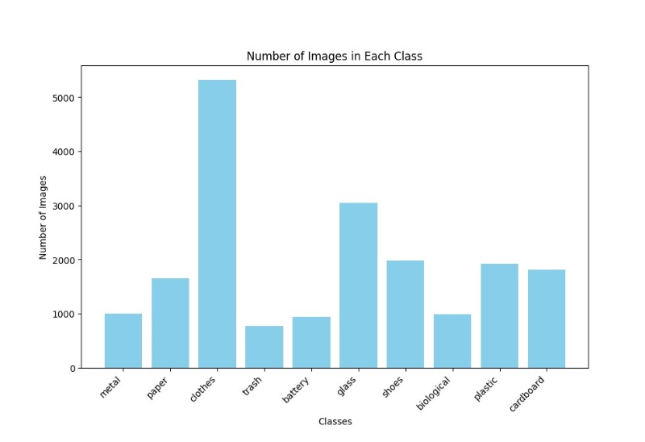
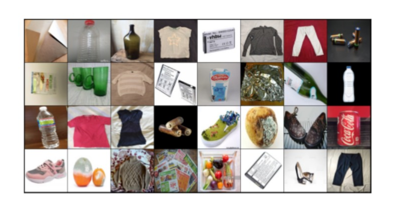
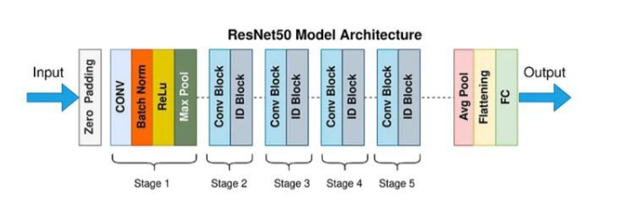
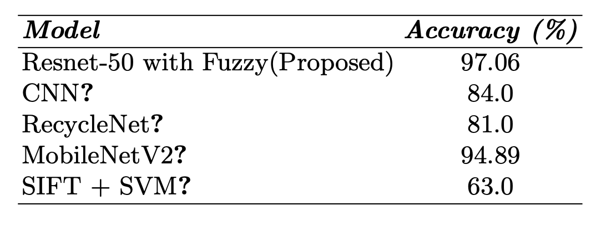
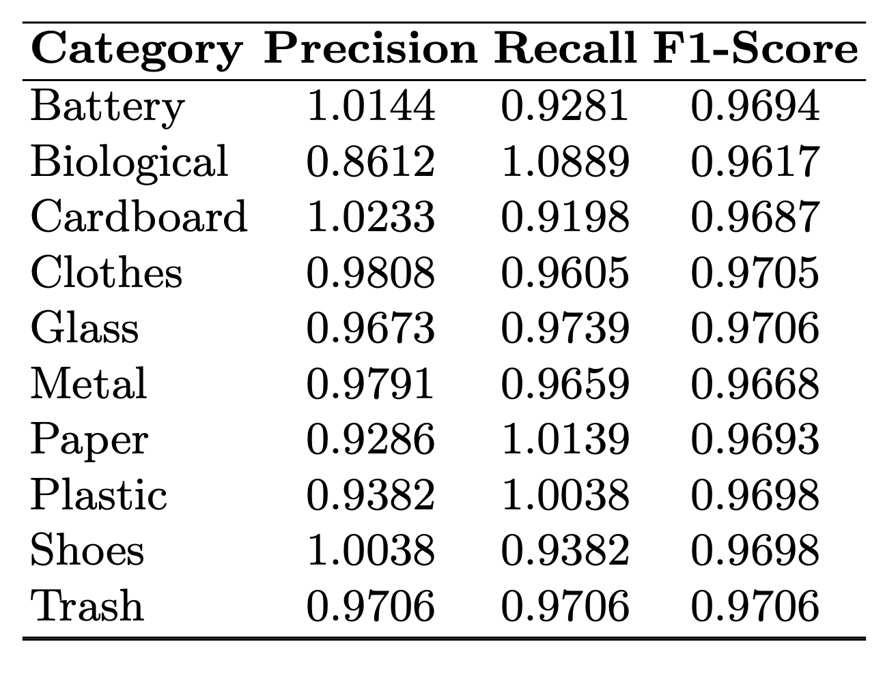
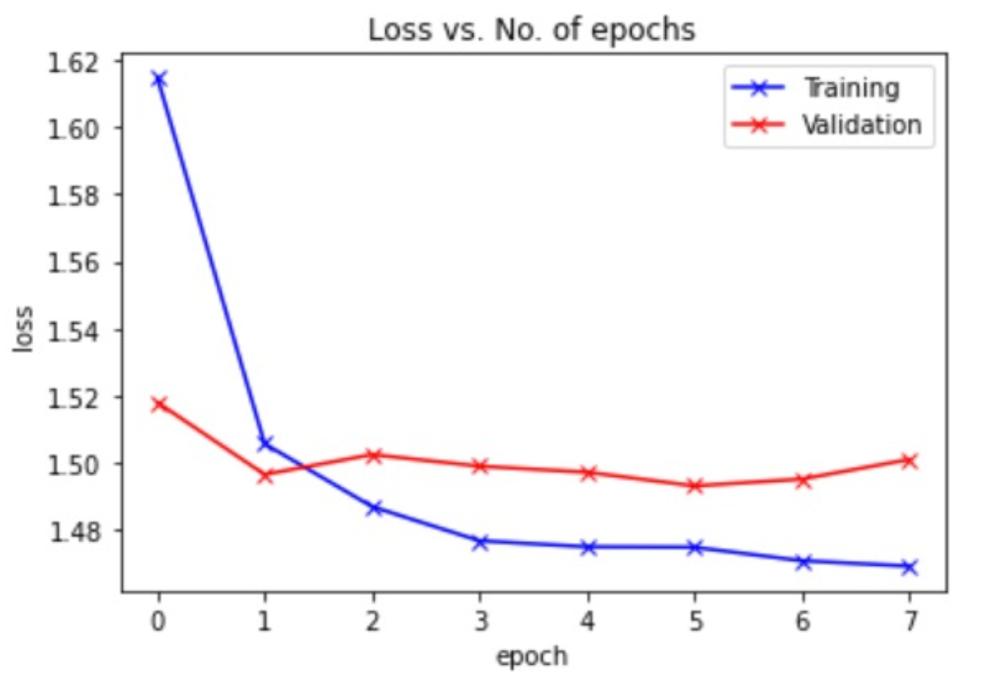

# **Optimization of ResNet-50 Architecture for Imbalanced Dataset using Fuzzy Cost-Sensitive Learning**
---
## **Introduction**
Imbalanced datasets are a significant challenge in real-world machine learning applications, especially in image classification tasks where certain classes are severely underrepresented. Traditional deep learning models often become biased toward majority classes, leading to poor recognition of rare or minority categories.

This project proposes an optimized ResNet-50 architecture integrated with Fuzzy Cost-Sensitive Learning (CSL) to effectively address class imbalance. By introducing fuzzy logic into the cost-sensitive learning framework, the system dynamically adjusts misclassification penalties during training. This allows the model to better focus on underrepresented classes while maintaining overall classification performance.

The model is evaluated on a garbage classification dataset with ten waste categories, demonstrating a high accuracy of 97.06%, outperforming conventional methods such as standard CNNs and MobileNetV2. The proposed approach is highly practical for real-world applications such as automated waste sorting, environmental monitoring, and other scenarios where fair and accurate classification is crucial.

## **Objectives**
**1.Improve the classification performance on imbalanced datasets.**  
**2.Minimize misclassification of minority classes.**  
**3.Demonstrate the effectiveness of integrating fuzzy logic into cost-sensitive learning.**  
**4.Provide a practical solution for real-world waste classification systems.**  

## **Dataset Description**
The study focuses on addressing the unique challenges presented by an imbalanced garbage classification dataset. The dataset includes ten distinct categories: battery, biological, cardboard, clothes, glass, metal, paper, plastic, shoes, and trash.

The distribution of the dataset is highly uneven. Categories such as clothes contain a significantly larger number of images, while others such as metal and battery are underrepresented. This imbalance poses a challenge for the model to perform consistently well across all classes.

 

  

<h4 align="center">Dataset Size</h4>

  

<h4 align="center">Dataset Example</h4>

## **Proposed Methodology**
The proposed approach integrates the ResNet-50 architecture with fuzzy cost-sensitive learning to address class imbalance. The pipeline begins with preprocessing the garbage dataset, including resizing, normalization, and augmentation.

All images were resized to 256×256 pixels to maintain uniformity. Augmentation techniques such as random rotations, flips, and cropping were applied to increase the variety of images for underrepresented classes without altering their key features. Pixel values were normalized to a scale of 0 to 1 to accelerate the training process.

The ResNet-50 model was used as the core feature extractor. Pretrained on ImageNet, the ResNet-50 architecture was adapted by replacing the final output layer to support ten waste categories. The initial layers were kept unchanged to retain general feature learning abilities, while the later layers were fine-tuned for dataset-specific patterns.

The fuzzy penalty loss function introduced a dynamic way to address the uneven distribution of classes. Instead of treating all misclassifications equally, this function adjusted penalties based on class distribution. Higher penalties were assigned for errors in rare categories such as battery and metal, and lower penalties for common categories like clothes. Penalties were updated dynamically during training, encouraging balanced and fair learning.

The fuzzy penalty loss is defined as:  
LFuzzy = - (1 / N) ∑i=1N wyi · log(pyi)  
Where:

- *w**yᵢ*: weight assigned to the true class *yᵢ*, inversely related to class frequency.
- *p**yᵢ*: predicted probability for the true class.
- *N*: total number of samples.

The model was trained using the Adam optimizer with an initial learning rate of 0.001, gradually reduced during training. Batch sizes of 32 or 64 were used, and dropout layers were added to avoid overfitting.

## **Architecture**

### **Architecture Of ResNet50 Model**

 

The ResNet-50 architecture is a deep convolutional neural network consisting of 50 layers, specifically designed to overcome challenges such as vanishing gradients and degraded performance in very deep networks.

The main innovation in ResNet-50 is the introduction of residual learning using shortcut (skip) connections. Instead of learning an underlying mapping directly, residual blocks learn the residual function, allowing gradients to flow more easily during backpropagation. This facilitates the training of much deeper networks.

The architecture is composed of a series of convolutional layers, batch normalization layers, ReLU activation functions, and identity shortcuts. ResNet-50 includes two main types of residual blocks:

**1.Identity Blocks**: Used when the input and output dimensions are the same. The shortcut connection simply performs identity mapping and is added to the output of the stacked layers.  
**2.Convolutional Blocks**: Used when the input and output dimensions differ. The shortcut connection includes a convolution operation to match dimensions before addition. 
  
The overall structure of ResNet-50 can be summarized as follows:  

**- Initial layers**: A convolution layer with a large kernel (7×7), followed by batch normalization, ReLU activation, and a max pooling layer to reduce spatial dimensions.  
**- Four stages of residual blocks**: Each stage consists of multiple residual blocks with increasing feature map depth and decreasing spatial resolution.  
**- Global average pooling layer**: Reduces each feature map to a single value, preserving spatial information efficiently.  
**- Fully connected layer**: Outputs final class scores. In this project, this layer is replaced to support ten waste categories. 
  
The use of shortcut connections in residual blocks makes ResNet-50 highly effective at feature extraction, even in complex and imbalanced datasets. In this project, the ResNet-50 architecture is further enhanced by integrating fuzzy cost-sensitive learning to improve minority class detection and maintain high overall accuracy.  

## **Experimental Results**
This section presents the description of the imbalanced garbage classification dataset and the detailed results of the proposed model compared with other baseline approaches.  

The integration of ResNet-50 with fuzzy logic delivered a strong accuracy of 97.06%, significantly improving upon existing models. The fuzzy logic component dynamically adjusted weights during training based on class distribution, effectively addressing class imbalance and improving minority class detection without sacrificing overall accuracy.  

### **Accuracy Comparison**
The performance of the proposed model was compared against several existing models, as summarized in the table below
 

  

  

The proposed ResNet-50 with fuzzy cost-sensitive learning outperformed all other approaches, achieving the highest accuracy.  

### **Classification Performance Metrics**
The detailed classification performance for each category, including precision, recall, and F1-score, is presented in the following table:  
 

  

  

The results show that the model performed consistently across all categories, significantly reducing false negatives in rare classes such as battery and metal.  

### **Loss vs. Number of Epochs**
The training and validation loss curves demonstrate stable and rapid convergence. The model achieved its peak performance after only three epochs, confirming efficient learning dynamics.  

 

  

  

The dynamic weighting strategy prevented overfitting and improved the model's ability to generalize to new data. Additionally, augmentation techniques enhanced the model’s capability to handle variations in minority classes.  

## **Conclusion**
The integration of fuzzy cost-sensitive learning with the ResNet-50 architecture effectively addresses the challenges associated with class imbalance in image classification tasks. By dynamically adjusting misclassification penalties using fuzzy logic, the proposed model improved the recognition of minority classes while maintaining high overall accuracy.  

The model achieved a significant accuracy of 97.06% on the imbalanced garbage classification dataset, outperforming baseline models such as MobileNetV2, CNN, and SIFT + SVM. The fuzzy penalty loss function played a crucial role in enhancing fairness across all categories, substantially reducing false negatives in underrepresented classes.  

The proposed framework minimizes the need for extensive preprocessing and provides a scalable and practical solution suitable for real-world waste management applications. By ensuring balanced learning and robust feature extraction, the system demonstrates strong potential for deployment in resource-constrained and operational environments.  

## **Future Work**
Future directions include expanding the dataset to incorporate additional waste categories and exploring advanced data augmentation techniques to further improve model robustness.  

Optimizing the model for real-time deployment on embedded or low-power edge devices will enhance practical usability in smart bins and automated waste sorting systems.  

Additionally, implementing multi-label classification capabilities and collaborating with waste management experts can further increase the impact and applicability of the system for efficient and intelligent waste management solutions.  

